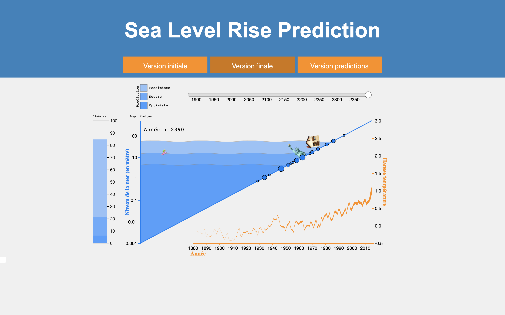
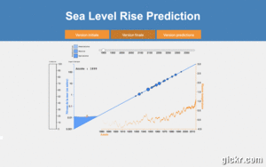

# seaLevelProjet.github.io

# Table of Contents
1. [Data](#Data)
2. [Objectives of the project](#Objectives)
3. [Realization](#Realization)
4. [Improvements](#Improvements)
5. [Sources](#Source)

# Sea Level Rise Prediction

# Data
Our visualization is intended to show the evolution of sea level. We have retrieved sea level data from 1880 to 2015 based on the assuseaLevel.pngmption that sea level was 0 in 1880. We also have temperature data from 1880 to 2015.

In addition, based on these data, we made predictions (on R) of sea level and temperature up to 2400. We have made three predictions: an optimist, a pessimist and an intermediary. For this purpose we used an exponential model by varying the parameter with 3 different values.

The data sets were retrieved from this address: https://datahub.io/core/sea-level-rise#resource-sea-level-rise_zip

# Objectives
Our objective is to show the correlation between temperature increase and sea level rise but also to show the possible consequences of these increases.

# Realization
The visualization consists of two graphs:

- A "triangle" (top left): This triangle represents a coast that is gradually being submerged by water. This graph allows to see the rise of the water over time using the temporal slider placed above the visualization.
Along the slope are placed several large cities in order to observe the cities that will be submerged if the phenomenon continues in this direction. By passing over a city you can obtain additional information such as altitude, population,...

- A streamgraph: This streamgraph makes it possible to visualize both the evolution of the increase in the average temperature on the surface of the globe over time but also the evolution of sea level on Earth thanks to the thickness of the streamgraph. There is a correlation between sea level and temperature since over the years sea level and temperature increase at the same time.

# Improvements

Following the presentation, we modified elements of the visualization. We have made two versions:

- Version 2: Version that does not include temperature predictions up to 2400, we have been asked to add temperature predictions up to 2400 on the streamgraph, we think that by adding this the visualization is no longer aesthetic. This is the version we prefer.

- Version 3: Version that includes temperature predictions on the streamgraph.

An element has been added to the visualization:

- A vertical gauge: On versions 2 and 3 (following the presentation), we placed a vertical gauge to the left of the graphs to allow a linear view of the rising water. This makes it possible to clearly see the explosion of the phenomenon that was not visible with the logarithmic scale used for the graph. We have chosen to leave the logarithmic scale which allows us to see small variations in sea level that are not visible with the linear scale.

We also modified the display of cities along the slope.

# Source
To carry out this project, we drew inspiration from Mike Bostock's examples and this visualization: https://bl.ocks.org/lsbardel/d686414f38742cb60c3bf3f21b79b9df (to make the waves).
