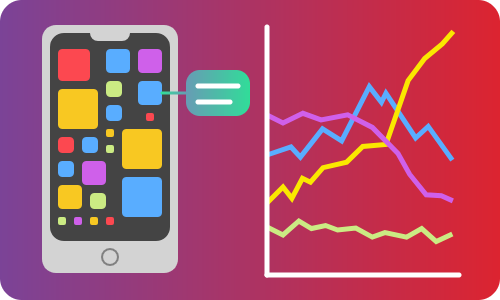
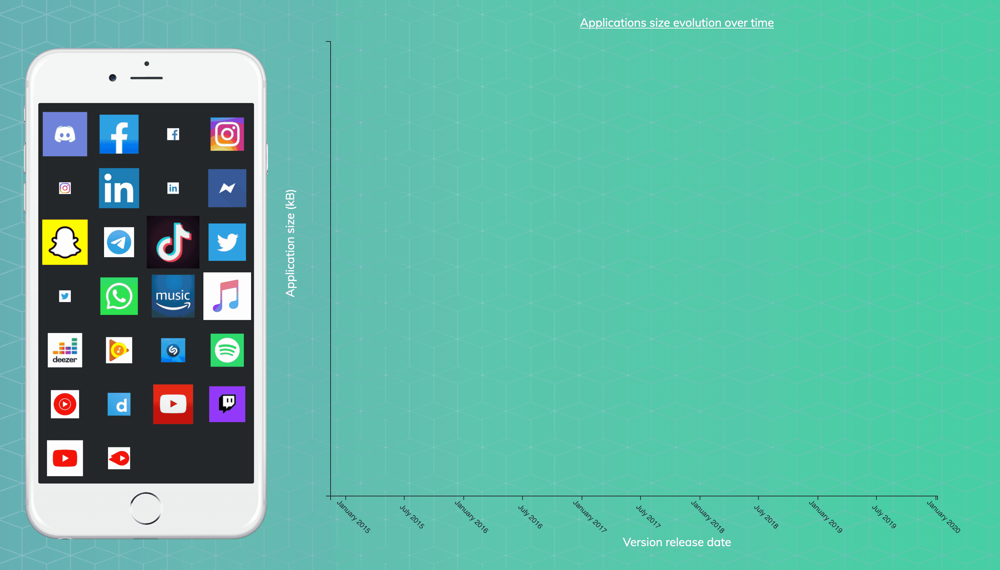

### [Dataviz - Applications Memory Consumption](https://github.com/Sitiel/App-size-compare)

The memory of our phone is often perceived as an element limiting the functionality of our devices, preventing us from installing certain applications that have sometimes become too greedy in terms of space. It's also becoming increasingly difficult to update all the applications due to their increasing size. But how much does this size change over the months? Are there alternatives, lighter apps to replace the ones we can't keep anymore? Is the size difference between applications important between Android and iOS phones?

This school project aim is to, through a web page, visualize and clarify those questions that users find it difficult to outline with their device.

The website can be found here: https://sitiel.github.io/App-size-compare/

