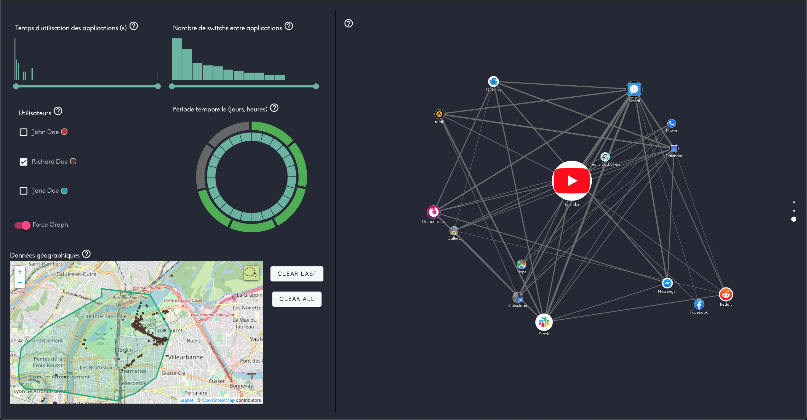

# Toxicity League Of Legends

## Summary

[League Of Legends](https://leagueoflegends.com), developed by [Riot Games](https://www.riotgames.com), is one of the world's most popular game, however unfavorably known for the notorious toxicity and overall incivility of its community. Using data collected directly from players and the games they played, our goal is to try to identify the sources of certain toxic behaviours.

Our visualisations can answer the following questions:
- Which game factors are significant in characterizing a potential toxic player?
- Are playable champions balanced?
- Does [Riot Games](https://www.riotgames.com) have any responsabilities regarding its community toxicity?

## Representative image

Here is a representative image of the project to make you want to answer questions:

## A few links

- Link to the [project](https://github.com/SamyBO98/Toxicity_LoL).
- Link to the [project website](https://samybo98.github.io/Toxicity_LoL/)
- Link to the [course website](https://lyondataviz.github.io/teaching/lyon1-m2/2021/)
- Link to the person in charge of the course [Aurélien Tabard](https://tabard.fr/).
- Links to project members: [Azziz Otman](https://github.com/otmanazziz), [Ben Abdallah Nour](https://forge.univ-lyon1.fr/p1710076), [Ben Othman Samy](https://github.com/SamyBO98) and [Raybaud--Serda Jonathan](https://github.com/j-raybaudserda).
- Link to [the AI formation](http://master-info.univ-lyon1.fr/IA/) (*Artificial Intelligence*) and [the DS formation](http://master-info.univ-lyon1.fr/DS/) (*Data Science*).
- Link to the [Lyon 1 Claude Bernard University](https://www.univ-lyon1.fr/) website.

## Our inspiration sources

- https://www.datavis.fr/index.php?page=transition
- https://www.d3-graph-gallery.com/graph/custom_responsive.html#bootstrap
- https://codepen.io/anon/pen/VagxKp?editors=0010
- https://jonathansoma.com/tutorials/d3/using-scales/
- https://www.d3-graph-gallery.com/graph/histogram_double.html
- https://observablehq.com/@d3/bar-chart
- https://github.com/alangrafu/radar-chart-d3
- https://www.stashofcode.fr/rotation-dun-point-autour-dun-centre/
- https://developer.riotgames.com/apis#match-v5/GET_getMatch