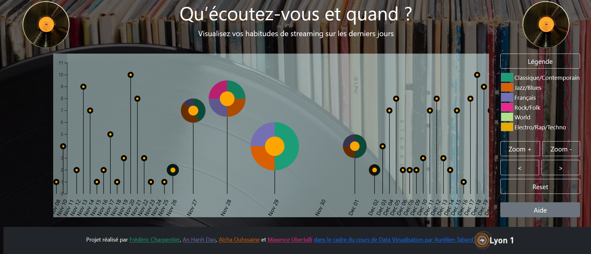

# Music streaming data

This project aims at visualising one's daily use of online streaming music, to reveal the daily amount of records one listened to, as well as the distribution of musical genres and its evolution across time.

It features a combined view of a histogram of the number of records and pie charts giving the musical genres distribution with a neat transition between the two, animated by the mouse moves.
