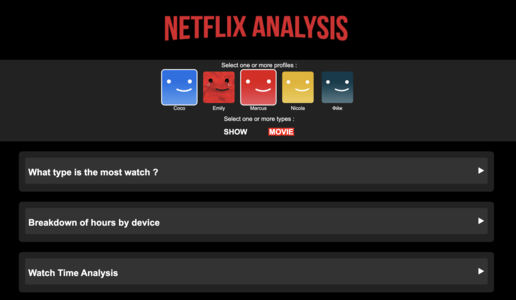

# Netflix Viewing Data Analysis of 3 Students

## Project Objective

This project aims to analyze and compare the Netflix viewing data from different profiles on the same account. Through interactive visualizations, it seeks to answer the following questions:

- What are the most-watched genres of movies and/or series?
- What are the most frequently used devices for watching movies and/or series?
- How is the viewing of movies and/or series distributed across hours, days of the week, months, and years?
- What are the top 20 most-watched movies and/or series?
- What are the top 5 movies and/or series most watched per profile?

We developed eight main visualizations that provide a detailed analysis of movie and series viewing behaviors. These visualizations are interactive, using a menu that allows users to select different profiles and filter by movies and/or series.

## Main Visualizations

1. **Bubble Chart of the Most-Watched Genres**  
   This chart shows the most-watched genres. By hovering over a bubble, you can see the exact number of hours and minutes viewed.

2. **Donut Chart of Device Usage Analysis**  
   This chart displays the distribution of viewership based on devices used. Hovering over a section reveals the precise number of hours and minutes viewed.

3. **3 Radar Charts for Viewing Time Distribution**  
   These charts allow users to visualize the distribution of viewed content based on three axes:  
   - Hours of the day  
   - Days of the week  
   - Months of the year  
   Hovering over the radar points reveals detailed data.

4. **Line Chart for Annual Viewing Distribution**  
   This chart shows the distribution of viewed content year by year. Hovering over a point displays precise data.

5. **Bar Chart of the Top 20 Most-Watched Content**  
   A ranking of the top 20 most-watched movies or series represented as a bar chart.

6. **Top 5 Most-Watched Content per Profile**  
   This ranking presents, in list format, the top 5 most-watched movies and series for each profile. Hovering over the images displays detailed data.

## Project Creation  

This project was developed by Prioux Léo-Paul, Drici Mohammed Islam, and Bettahar Walid as part of a data visualization course for the Master’s program in Data Science (M2) at Université Lyon 1.  
You can find more details about the course here:  
https://lyondataviz.github.io/teaching/lyon1-m2/2024/

## Website Access

Explore the visualizations directly on the project website:  
http://netflix-visualisation-e752aa.pages.univ-lyon1.fr/

## Sources and Inspiration  

The data was collected from this page: [Netflix - Get My Info](https://www.netflix.com/account/getmyinfo).  
We drew inspiration from this visualization to create our own types of charts: [Reddit - Netflix Viewing Habits Visualized](https://www.reddit.com/r/dataisbeautiful/comments/97rbih/netflix_viewing_habits_visualized_create_your_own/#lightbox).  
Additionally, we adopted elements from Netflix’s graphic style and this visualization: [Imgur - Example Visualization](https://imgur.com/a/gIdIyX3).
